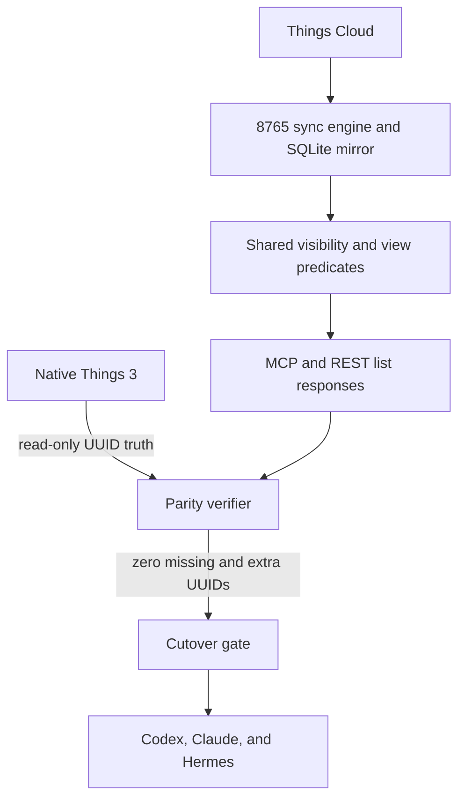
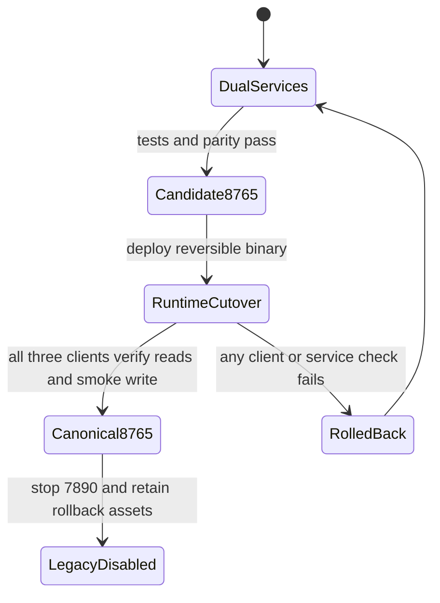

# Fix Native Things View Parity and Consolidate Runtime Access

## Goal Capsule

- **Objective:** Make the local Things Cloud MCP on port 8765 accurately reproduce native Things list membership, then use it as the sole Things integration for Codex, Claude, and Hermes.
- **Authority:** Native Things AppleScript UUID sets define list membership; the cloud mirror supplies MCP data and writes; this plan defines implementation and rollout order.
- **Execution profile:** Characterization-first query repair followed by a reversible local rollout.
- **Stop conditions:** Do not repoint Codex or Claude, disable port 7890, or replace the running 8765 binary unless focused tests pass and native-versus-MCP UUID parity is clean for the required views.
- **Tail ownership:** The implementation run owns code, tests, local deployment, runtime cutover, rollback rehearsal, PR creation, and CI follow-through.

---

## Product Contract

### Summary

The Mac currently has two Things MCP services. The legacy Python service on port 7890 cannot open its database, while the Go Things Cloud service on port 8765 reads a current mirror but misclassifies native views. Hermes already uses 8765; Codex and Claude still use 7890. The desired end state is one reliable MCP endpoint on 8765, with AppleScript retained only as a read-only truth check and emergency diagnostic path.

### Problem Frame

Native Things and the 8765 API disagree even though the relevant task UUIDs exist in the cloud mirror. On 2026-07-13, native Today contained 39 tasks while 8765 returned 21. Inbox matched at 486, but Anytime, Someday, and Upcoming also showed count differences. The current SQL treats Today as an exact-date window, excludes completed tasks while allowing canceled tasks, and does not consistently account for tasks hidden by trashed or inactive parent containers. This makes the MCP unsafe as the common task surface for all runtimes.

### Requirements

**View correctness**

- R1. The 8765 Today result must match the native Things Today UUID set, including carry-over tasks and excluding canceled, trashed, deleted, and hidden-by-parent tasks.
- R2. Anytime must contain the full active `schedule=1` population, including tasks also shown in Today, matching native Things' inclusive view behavior.
- R3. Inbox, Anytime, Someday, and Upcoming must each be compared by UUID against their native Things list before cutover; any mismatch must be fixed or explicitly block rollout.
- R4. Default active-list queries must return pending tasks only; optional completed/trashed query behavior must remain deliberate and covered.

**Operational reliability**

- R5. The parity check must be read-only and must report counts plus missing and extra UUIDs without changing Things, the mirror, or runtime configuration.
- R6. Existing MCP read and write capabilities must remain available after the query repair, including a controlled create/edit/complete/trash smoke cycle.
- R7. The server must support the configured local database path without requiring the container-only `/data` layout.

**Single integration**

- R8. Codex, Claude, and Hermes must all use the same local MCP URL on port 8765 after parity and smoke checks pass.
- R9. The legacy service on port 7890 must remain available until all three runtimes have been verified against 8765, then be disabled without deleting its environment or files.
- R10. Rollback must restore the previous runtime registrations, 8765 binary/service state, and 7890 availability without touching Things data.
- R11. The canonical 8765 service must bind to loopback only; it must not expose unauthenticated Things data or write tools on other network interfaces.

### Acceptance Examples

- AE1. Given a pending task carried into Today from an earlier date, when 8765 lists Today and Anytime, then the task appears once in each native view result.
- AE2. Given a canceled task or a task inside a trashed project, when any active native view is listed, then 8765 does not return it.
- AE3. Given the five core native lists, when the parity verifier runs, then every list reports zero missing UUIDs and zero extra UUIDs before cutover.
- AE4. Given Codex, Claude, and Hermes after cutover, when each lists Today through its `things` MCP, then each reaches 8765 and receives the same result.
- AE5. Given a failed deployment or runtime verification, when rollback is invoked, then the prior binary/configuration is restored and 7890 can be re-enabled without modifying Things tasks.

### Scope Boundaries

**In scope**

- Native list classification for Today, Inbox, Anytime, Someday, and Upcoming.
- Shared visibility rules for canceled, completed, trashed, deleted, and parent-hidden tasks.
- A durable read-only native-versus-MCP parity verifier.
- Local 8765 deployment, three-runtime cutover, legacy-service retirement, and rollback documentation.

**Out of scope**

- Replacing this repo with `wbopan/things-cloud-mcp` or using its public hosted endpoint.
- Adding public multi-user OAuth, exposing 8765 beyond the local machine, or adopting `wbopan` tool names.
- Changing Things task organization, dates, tags, projects, or Today ordering outside the controlled smoke-test item.
- Using private or experimental Things scripting commands.

### Assumptions

- The cloud mirror is current enough for parity checks because all previously missing Today UUIDs were present in it and live reads trigger sync.
- Native AppleScript list membership is the source of truth for this Mac, while the cloud service remains the write path.
- The existing uncommitted `DB_PATH` support in `server/main.go` is intentional local-runtime work and should be preserved, tested, and incorporated rather than discarded.

---

## Planning Contract

### Key Technical Decisions

- KTD1. **Repair the existing repo instead of migrating servers.** It already provides the persistent SQLite mirror, REST surface, 36 MCP tools, and the deployed 8765 binary. The `wbopan` repo is prior art for Today/date handling and diagnostics, not the runtime target.
- KTD2. **Treat list membership as a UUID-set contract.** Count equality can hide offsetting misses and extras; parity must compare exact native and MCP UUID sets.
- KTD3. **Centralize default task visibility.** Pending status and parent-container visibility should be expressed once and reused by core view queries so canceled or hidden tasks cannot leak differently across lists.
- KTD4. **Preserve native view overlap explicitly.** Today includes eligible `schedule=1` tasks with a relevant date before the next UTC day boundary; Anytime includes the complete active `schedule=1` population, including Today. Someday contains standalone deferred tasks, while Upcoming also includes repeating templates identified by their repeater rule (`rr`).
- KTD5. **Persist recurrence state and rebuild the disposable mirror once.** The cache gains both repeater rules (`rr`) and generated-instance links (`rt`) already present in cloud history; the schema upgrade clears local aggregate state and resyncs it so old rows cannot remain semantically incomplete. This does not modify Things data.
- KTD6. **Keep AppleScript outside the server request path.** It is a verifier and fallback diagnostic, not a runtime dependency for every MCP call.
- KTD7. **Cut over only after proof, with legacy retirement last.** The 8765 binary is replaced reversibly, runtime registrations move one at a time, and 7890 is disabled only after all clients succeed.
- KTD8. **Enforce local-only access at the listener.** The server gains an explicit bind-address setting and the Mac service uses loopback, avoiding a new authentication system while closing the current all-interface exposure.

### High-Level Technical Design

### Sequencing

1. Characterize and repair shared visibility plus Today/Anytime behavior.
2. Characterize the remaining native views and close any parity gaps.
3. Add the reusable parity verifier and local database-path coverage.
4. Deploy 8765 reversibly, verify read/write behavior, repoint clients, then disable 7890.

---

## Implementation Units

### U1. Establish shared active-task visibility

- **Goal:** Prevent canceled tasks and tasks hidden by deleted, trashed, completed, or canceled parent containers from leaking into active native views.
- **Requirements:** R1, R3, R4; AE2.
- **Dependencies:** None.
- **Files:** `sync/state.go`, `sync/integration_test.go`.
- **Approach:** Introduce a reusable query fragment or query builder for active task visibility, including direct project and heading-to-project ancestry. Preserve explicit `IncludeCompleted` and `IncludeTrashed` behavior instead of silently redefining those options.
- **Execution note:** Add characterization coverage for the current query behavior, then strengthen it with failing cases before changing production SQL.
- **Patterns to follow:** Existing `QueryOpts`, pagination helpers, executor locking, and temporary SQLite integration tests in `sync/integration_test.go`.
- **Test scenarios:**
  1. A pending standalone task is visible by default.
  2. Canceled and completed tasks are excluded from default active queries.
  3. A task whose direct project is trashed, deleted, completed, or canceled is excluded.
  4. A task under a heading whose project is hidden is excluded.
  5. `IncludeCompleted` and `IncludeTrashed` return only the additional states their names promise without weakening unrelated parent visibility.
- **Verification:** Focused sync tests prove the shared visibility contract and existing pagination still returns stable results.

### U2. Make Today and inclusive Anytime match native Things

- **Goal:** Include carry-over Today tasks while keeping Anytime as native Things' inclusive active view.
- **Requirements:** R1, R2, R4; AE1, AE2.
- **Dependencies:** U1.
- **Files:** `sync/state.go`, `sync/integration_test.go`, `sync/detect_test.go`.
- **Approach:** Replace exact-current-date membership with an inclusive carry-over rule bounded by the next UTC day. Express Anytime with explicit null checks so SQL three-valued logic cannot drop undated tasks. Keep ordering behavior stable.
- **Execution note:** Start by changing the existing Today/TIR test so an overdue pending task is expected in both Today and Anytime; observe the failure before implementation.
- **Patterns to follow:** `currentUTCDayBounds`, `TestTasksInTodayWithTIR`, and UTC location tests in `sync/detect_test.go`.
- **Test scenarios:**
  1. Covers AE1. A task dated yesterday appears once in Today and once in Anytime.
  2. A task dated today through either scheduled date or Today reference appears in Today exactly once.
  3. An undated `schedule=1` task appears in Anytime and not Today.
  4. A future-dated `schedule=1` task remains in Anytime and is excluded from Today until eligible.
  5. Day-boundary values immediately before and at next UTC midnight classify deterministically.
  6. Canceled and parent-hidden carry-over tasks remain absent.
- **Verification:** Focused tests pass and the live parity verifier reports zero Today misses/extras before any runtime cutover.

### U3. Characterize and repair Inbox, Someday, and Upcoming parity

- **Goal:** Ensure every core list used by the three runtimes matches its native Things UUID set.
- **Requirements:** R3, R4; AE2, AE3.
- **Dependencies:** U1, U2.
- **Files:** `sync/state.go`, `sync/store.go`, `sync/schema.go`, `sync/integration_test.go`, `sync/store_test.go`, `sync/sync_test.go`, `server/mcp_test.go`.
- **Approach:** Use live native UUID differences to build minimal fixtures for project-contained tasks, headings, repeating templates, generated instances, nil dates, future dates, and hidden parents. Persist both `rr` and `rt` state from cloud history, rebuild older cache state through a schema migration, keep Someday to standalone deferred tasks without a repeater rule, and include repeater templates in Upcoming. Keep each list's rule explicit where Things semantics differ.
- **Execution note:** Characterize each observed mismatch before changing its predicate. A view that already matches after U1 should receive regression coverage without extra production changes.
- **Patterns to follow:** Dedicated view query methods in `sync/state.go` and MCP read-handler coverage in `server/mcp_test.go`.
- **Test scenarios:**
  1. Inbox remains unchanged for pending standalone and project tasks.
  2. Someday excludes tasks that native Things hides because their containing project or heading is not visible.
  3. Upcoming includes future scheduled tasks and repeating templates with `rr` even when the template has no future date field; `rt`-linked generated instances remain eligible for Someday.
  4. Someday and Upcoming are mutually exclusive for eligible `schedule=2` tasks.
  5. MCP list handlers return the same UUID membership as the underlying state queries with pagination disabled.
  6. A schema-v4 cache upgrades to the recurrence-aware schema, clears incomplete aggregate state, and starts a clean cloud resync.
- **Verification:** All five core list UUID sets match native Things on the live Mac, and focused fixtures document every changed rule.

### U4. Add a durable read-only parity and deployment check

- **Goal:** Make native-versus-8765 verification repeatable without ad hoc SQL or task mutation.
- **Requirements:** R3, R5, R7, R11; AE3.
- **Dependencies:** U2, U3.
- **Files:** `cmd/parity/main.go`, `cmd/parity/main_test.go`, `cmd/README.md`, `server/main.go`, `server/main_test.go`, `docs/installation.md`.
- **Approach:** Add a Mac-local diagnostic command that reads native list UUIDs through ordinary AppleScript, reads the five 8765 REST views, and reports counts plus missing/extra UUIDs. Return failure when any required view diverges or either source is unavailable. Preserve and test configurable `DB_PATH` startup behavior, and add a configurable HTTP bind address so the installed Mac service can be restricted to loopback without changing container defaults.
- **Execution note:** Keep the verifier side-effect-free; use injected command/HTTP boundaries in tests rather than launching Things during the automated suite.
- **Patterns to follow:** Existing `cmd/*` utilities, standard HTTP client timeouts, and startup helper tests in `server/main_test.go`.
- **Test scenarios:**
  1. Equal UUID sets in different orders report parity.
  2. One missing and one extra UUID are both reported and produce failure.
  3. Duplicate UUID input is normalized or rejected consistently.
  4. AppleScript failure, malformed REST output, HTTP timeout, and unavailable service each produce a clear nonzero result.
  5. An explicit database path is honored; absence falls back to `/data/things.db`.
  6. An explicit loopback bind address is honored while the existing default remains compatible with container deployment.
- **Verification:** Unit tests cover set comparison and failure handling; a live read-only run reports zero differences for all required views.

### U5. Deploy 8765 and consolidate all runtimes

- **Goal:** Make 8765 the single Things MCP used by Codex, Claude, and Hermes, then retire the broken 7890 service reversibly.
- **Requirements:** R6, R8, R9, R10, R11; AE4, AE5.
- **Dependencies:** U1, U2, U3, U4.
- **Files:** `docs/installation.md`, `docs/2026-03-05-mcp-today-mismatch-incident.md`.
- **Approach:** Record current binary, service, and runtime-registration state; build and install the candidate binary with a timestamped rollback copy; configure 8765 for loopback-only binding; restart only the 8765 LaunchAgent; run listener, health, parity, and controlled MCP smoke checks; repoint Codex then Claude while confirming Hermes remains correct; verify each in a fresh client process; finally unload and disable 7890 without deleting its files. Document exact rollback order and the final ownership model.
- **Execution note:** Treat this as an operational gate. Any parity, smoke, or fresh-client failure stops the cutover and restores the previous state before further work.
- **Patterns to follow:** Existing fail-fast startup, graceful shutdown, `things_smoke_test`, and the repo's prior incident documentation.
- **Test scenarios:**
  1. Candidate 8765 starts against the configured persistent database and passes health plus native parity.
  2. The listener is reachable on loopback and absent from non-loopback interfaces.
  3. The controlled smoke item completes the create/read/edit/complete/trash cycle and leaves no active residue.
  4. Covers AE4. Fresh Codex, Claude, and Hermes processes each list Today through 8765 with identical membership.
  5. 7890 remains running until all fresh-client checks pass, then is absent from listeners while 8765 remains healthy.
  6. Covers AE5. A simulated failed client check follows the documented rollback path and restores prior registrations and service availability.
- **Verification:** One listener remains for the canonical Things MCP, all three runtimes identify 8765 as `things`, native parity is clean, and rollback artifacts are retained.

---

## Verification Contract

| Gate | Applies to | Verification | Done signal |
|---|---|---|---|
| Focused query tests | U1-U3 | `go test ./sync ./server` | All view and visibility fixtures pass |
| Full Go suite | U1-U4 | `go test ./...` | No package regressions |
| Static analysis | U1-U4 | `go vet ./...` | No findings |
| Protocol/read regression | U3-U4 | Existing MCP protocol and read test suites | Tool discovery and list reads pass |
| Native parity | U2-U5 | `go run ./cmd/parity` against the live 8765 service | Five views show zero missing and zero extra UUIDs |
| Write smoke | U5 | Existing `things_smoke_test` through 8765 | Full lifecycle passes and cleanup succeeds |
| Fresh-runtime checks | U5 | Codex, Claude, and Hermes each invoke `things` | All resolve 8765 and return the same Today set |
| Listener exposure | U4-U5 | Inspect the active 8765 listener from loopback and a non-loopback address | Service is loopback-only |
| Rollback readiness | U5 | Validate backups and service/config restore order | Previous state can be restored without Things-data edits |

---

## System-Wide Impact

- **Users:** Marcus gains one consistent Things surface instead of runtime-dependent behavior.
- **Data:** The disposable cloud mirror receives one additive schema migration and automatic full resync; the Things database is untouched. The smoke test creates one temporary item and trashes it during cleanup.
- **Operations:** The 8765 LaunchAgent and three MCP registries change; 7890 is disabled only after validation.
- **Security:** The service is bound to loopback before cutover. The public `wbopan` endpoint and its credential handling are not adopted.
- **Compatibility:** Existing 36 MCP tool names stay stable, avoiding skill and prompt churn across runtimes.

---

## Risks and Dependencies

- **Undocumented cloud semantics:** Things Cloud fields are reverse-engineered. Mitigation: native UUID characterization, focused fixtures, and no migration.
- **App/cloud timing:** Native Things may update before cloud history arrives. Mitigation: parity checks sync first and distinguish unavailable/stale data from deterministic set differences.
- **Parent hierarchy edge cases:** Tasks can be direct project children or heading children. Mitigation: fixtures cover both ancestry paths.
- **Cache rebuild:** Persisting complete recurrence state requires one full mirror resync. Mitigation: fail-fast startup, untouched Things Cloud data, and a rollback copy of the prior binary and cache.
- **Live cutover risk:** A bad binary or config can remove task access from all runtimes. Mitigation: one-runtime-at-a-time cutover, retained 7890 state, timestamped backups, and immediate rollback on failure.
- **Network exposure:** The current 8765 process listens on all interfaces. Mitigation: add and verify an explicit loopback bind setting before considering the candidate deployable.
- **External runtime files are outside git:** Their exact prior values cannot be recovered from the PR. Mitigation: capture backups and a concise local receipt before mutation; never store credentials in the repo.

---

## Documentation and Operational Notes

- Update the existing mismatch incident with the final root cause, test coverage, and resolved parity evidence.
- Update installation guidance for local `DB_PATH`, parity verification, loopback-only use, and reversible service rollout.
- Keep credentials and runtime-specific secret values out of documentation, logs, commits, and PR text.
- Do not delete the legacy Python environment or LaunchAgent file during this change; disabling is sufficient.

---

## Sources and Research

- `README.md` and `CLAUDE.md` for the current repo architecture, tool surface, and sync model.
- `sync/state.go`, `sync/integration_test.go`, and `types.go` for current view predicates and status semantics.
- `docs/2026-03-05-mcp-today-mismatch-incident.md` and `docs/2026-03-15-stability-wrap-up.md` for prior cursor, concurrency, and stale-TIR incidents.
- Live 2026-07-13 evidence: native Today 39 versus 8765 Today 21; Inbox 486 versus 486; additional mismatches in Anytime, Someday, and Upcoming; corrected Today visibility/date predicate matched 39 UUIDs with zero misses and extras.
- [`wbopan/things-cloud-mcp`](https://github.com/wbopan/things-cloud-mcp) for prior art on carry-over Today filtering, diagnostics, and multi-client MCP transport. Its hosted architecture and public endpoint are not adopted.

---

## Definition of Done

- R1-R10 are satisfied with no launch-blocking open questions.
- U1-U5 verification outcomes pass and the full Go suite plus static analysis are clean.
- The five native view UUID sets match 8765 immediately before and after runtime cutover.
- Codex, Claude, and Hermes all use 8765 for `things`; no runtime still points to 7890.
- The 8765 listener is bound to loopback only.
- The 7890 listener is disabled only after successful cutover, and its files remain available for rollback.
- The PR contains the query repair, regression tests, parity tool, and documentation without credentials or unrelated changes.
- The local deployment has a tested rollback path and no user-authored Things data was modified beyond the cleaned-up smoke item.
